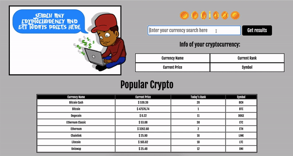

## Goal
Set up an express application using a former project. I worked off of an old cryptocurrency API project where a user could enter any crytocurrency and receive today's standings on that given currency.

## How it's made
Made using HTML, CSS, Javascript, Node.js, JSON, Express, EJS, MongoDB.

## Lesson Learned
It was difficult and very fustrating to get around the CORS error in the fetch at first, but after a lot of trial and error, and googling I stumbled upon a Node.js proxy which adds CORS headers to the proxied request. After I plugged that in, my issues were solved, but I'm very interested in learning other solutions to this same problem too.
